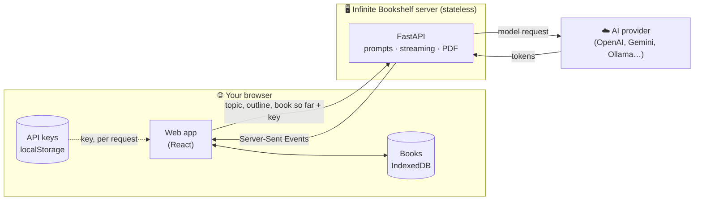

<div align="center">


# Infinite Bookshelf

**Turn a topic into a complete, structured book, written live by the AI model of your choice.**

Bring your own API key · 16 providers and any OpenAI-compatible API · Self-hosted in one container

[](https://github.com/Sasivarnasarma/infinite-bookshelf/actions/workflows/ci.yml)
[](https://github.com/Sasivarnasarma/infinite-bookshelf/releases)
[](LICENSE)
<br>


[Quick start](#-quick-start) · [Features](#-features) · [How it works](#-how-it-works) · [Privacy](#-your-data-stays-yours) · [Docs](#-documentation)

</div>

---

## ✨ What it is

Type a topic, such as _"The history of tea"_ or _"Linear algebra for programmers"_. Infinite Bookshelf
drafts a table of contents, lets you edit it, then writes the book section by section. You watch
every word stream in, the way a model writes it.

Each section knows the outline and what earlier sections already covered, so chapters build on each
other instead of repeating. You choose the model for every step, can switch it at any time, and can
rewrite any section with a note. When the book is done, export it as Markdown, a typeset PDF, or a
backup file.

It runs on **your** API keys, which never leave your browser except to make a request, and your
books never leave your browser at all.

## 🚀 Quick start

### 🐳 Docker (recommended)

```bash
git clone https://github.com/Sasivarnasarma/infinite-bookshelf.git
cd infinite-bookshelf
docker compose up -d
```

Open **http://localhost:9752**.

### 💻 From source

Needs [uv](https://docs.astral.sh/uv/), Node.js 22+ and [pnpm](https://pnpm.io/).

```bash
pnpm bootstrap         # install everything
cp .env.example .env   # optional settings
pnpm dev               # API on :8000, web app on :5173
```

Open **http://localhost:5173**.

### 📦 Without Docker

To run the finished app on a server without Docker, build it once and start it:

```bash
pnpm bootstrap         # install everything
pnpm build             # build the web app
pnpm start             # serve the app and the API → http://localhost:9752
```

One process serves everything on port 9752, like the container. See
[Self-hosting → Without Docker](docs/self-hosting.md#-without-docker) for keeping it running with
systemd.

Then go to **Settings → Providers & models**, add a provider, and paste your API key. Google Gemini
has a generous free tier, and [Ollama](https://ollama.com) runs models on your own machine with no
key at all.

> [!TIP]
> On **GitHub Codespaces**, or anywhere the container can't look up domain names, run
> `docker compose up -d infinite-bookshelf-host` instead. It uses the host's network.
> See [Self-hosting](docs/self-hosting.md#-troubleshooting).

## 🌟 Features

<table>
<tr>
<td width="50%" valign="top">

### 📝 Write

- **Outline first.** Review the drafted contents before anything is written: rename, reorder by
  drag and drop, change levels, add or remove entries.
- **Live streaming.** Every section appears word by word as the model writes it.
- **Connected chapters.** Each section sees the outline and a digest of earlier sections.
- **Whole book or chapter by chapter.** Stop after each chapter to read it before the next.
- **Pause and resume** at any time, even after closing the tab.
- **Your direction:** section length, writing style, depth, guidelines, and your own notes or a
  `.txt`/`.md` file as source material.

</td>
<td width="50%" valign="top">

### 🤖 Models

- **16 built-in providers**, plus any OpenAI-compatible API.
- **A model per step:** outline, title and chapters can each use a different model, even from
  different providers.
- **Switch models** whenever the book is paused; each section records which model wrote it.
- **Several keys per provider**, with automatic switching when one fails and optional rotation.
- **Suggestions** of the best, balanced and fast models you have for each step.
- **Local models** through Ollama and LM Studio.

</td>
</tr>
<tr>
<td width="50%" valign="top">

### 🪄 Refine

- **Rewrite any section** with a note, such as _"add a worked example"_, using the same model or
  another one. The original stays until the new version is finished.
- **Maths** ($a^2 + b^2 = c^2$), tables and highlighted code, in the reader and the PDF.
- **Follow along:** the reader scrolls with the section being written, until you scroll away.

</td>
<td width="50%" valign="top">

### 📦 Export and more

- **Markdown**, a **typeset PDF** (title page, contents with page numbers, maths), or a **JSON
  backup** to move books between devices.
- **Light and dark themes**, three reading sizes.
- **Works on phones and tablets.**
- **Interactive API docs** at `/api/docs`.

</td>
</tr>
</table>

### Supported providers

| Kind                            | Providers                                                                                                              |
| ------------------------------- | ---------------------------------------------------------------------------------------------------------------------- |
| **Model makers**                | OpenAI · Anthropic Claude · Google Gemini · xAI Grok · DeepSeek · Mistral AI · Moonshot Kimi · Alibaba Qwen · Z.ai GLM |
| **Gateways and fast inference** | OpenRouter · Groq · Together AI · Fireworks AI · Cerebras                                                              |
| **On your own machine**         | Ollama · LM Studio                                                                                                     |
| **Anything else**               | Any OpenAI-compatible API, added with its base URL (vLLM, LiteLLM, llama.cpp server…)                                  |

Free tiers: Google Gemini, Groq and Cerebras. Ollama and LM Studio need no key.

## 🔍 How it works



1. **Outline.** The server asks your outline model for a table of contents and your title model for
   a title, streaming both back.
2. **Review.** You edit the outline in the browser, or skip review and start writing at once.
3. **Write.** The browser asks for one section at a time, sending the outline and the sections
   written so far. The server builds the prompt and streams the model's words back. Each finished
   section is saved in your browser straight away.
4. **Export.** Markdown and backups are made in the browser; the server typesets PDFs.

The server stores nothing: no database, no accounts, no sessions. Read the
[architecture guide](docs/architecture.md) for the details.

## 🔒 Your data stays yours

|              | Where it lives                  | What the server does                                                      |
| ------------ | ------------------------------- | ------------------------------------------------------------------------- |
| **API keys** | Your browser (or only this tab) | Uses the key for one request, then forgets it. Never stored or logged.    |
| **Books**    | Your browser's IndexedDB        | Receives the outline and text needed for each request, then forgets them. |
| **Settings** | Your browser                    | Nothing.                                                                  |

- The page loads **no third-party scripts, fonts or trackers**, under a strict Content Security Policy.
- Turn off **Remember my keys** and they're kept only until you close the tab.
- Back books up from **Settings → Your data**; they exist nowhere else.

> [!IMPORTANT]
> Running a server for other people? Read
> [Running a public instance](docs/self-hosting.md#-running-a-public-instance) first. The default
> Docker Compose file is set up for a **private** server.

## 📚 Documentation

| Guide                                | What's in it                                                                            |
| ------------------------------------ | --------------------------------------------------------------------------------------- |
| [Self-hosting](docs/self-hosting.md) | Docker, configuration, local models, reverse proxies, public instances, troubleshooting |
| [Architecture](docs/architecture.md) | How the browser and server work together, streaming, prompts, PDF export, security      |
| [API reference](api/README.md)       | Endpoints, request bodies, streamed events, error codes                                 |
| [Contributing](CONTRIBUTING.md)      | Development setup, checks, tests and commit style                                       |
| [Security policy](SECURITY.md)       | How to report a vulnerability, and what's protected                                     |

## 📁 Project layout

```text
infinite-bookshelf/
├── api/                  Python API: FastAPI, uv, pytest
│   ├── src/infinite_bookshelf/
│   │   ├── engine/       book-writing logic: prompts, providers, PDF (no web code)
│   │   └── server/       HTTP layer: routes, streaming, security, settings
│   └── tests/
├── web/                  Web app: React 19, TypeScript, Vite, Tailwind CSS, Vitest
│   └── src/              pages, components, and lib/ (the writing loop, storage, settings)
├── docs/                 Architecture and self-hosting guides
├── Dockerfile            One image: the API serving the built web app
├── docker-compose.yml    Self-hosting on port 9752
└── .env.example          Every setting, with its default
```

| Command          | What it does                                                           |
| ---------------- | ---------------------------------------------------------------------- |
| `pnpm bootstrap` | Install the web and API dependencies                                   |
| `pnpm dev`       | Run the API (`:8000`) and web app (`:5173`), both reloading on changes |
| `pnpm check`     | Everything CI runs: formatting, lint, typecheck and all tests          |
| `pnpm test`      | Web tests (Vitest), then API tests (pytest)                            |
| `pnpm format`    | Format the web app and docs (Prettier) and the API (Ruff)              |
| `pnpm build`     | Production build of the web app                                        |
| `pnpm start`     | Serve the built web app and the API on `:9752`, without Docker         |

## 🤝 Contributing

Issues and pull requests are welcome. Start with [CONTRIBUTING.md](CONTRIBUTING.md); please report
security problems privately, as described in [SECURITY.md](SECURITY.md).

## 💛 Credits

Infinite Bookshelf began as the [original Infinite Bookshelf](https://github.com/Bklieger/infinite-bookshelf)
by Benjamin Klieger, and this project is built on that idea.

<sub>Provider names and logos are trademarks of their owners, shown only to indicate compatibility.</sub>

## 📄 Licence

Distributed under the [MIT](LICENSE) License
