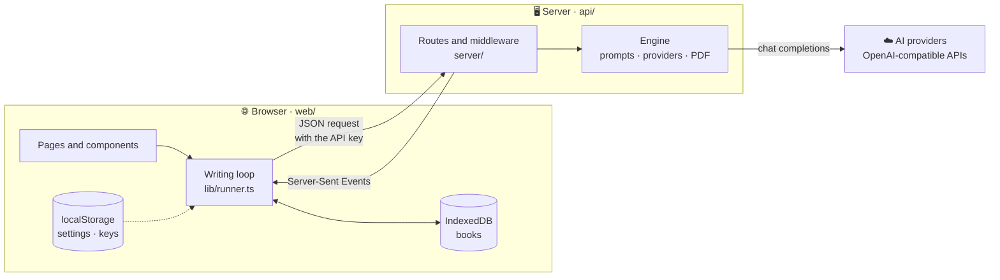
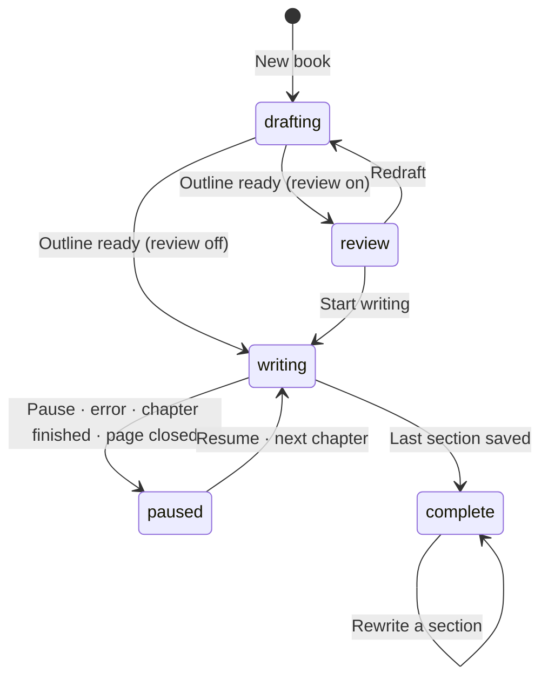
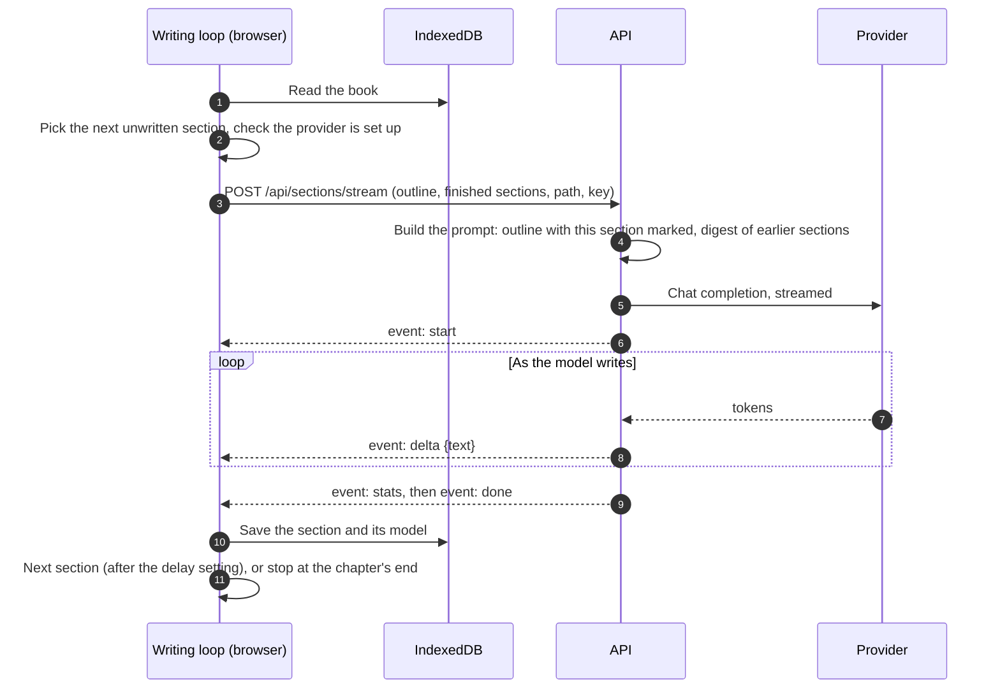
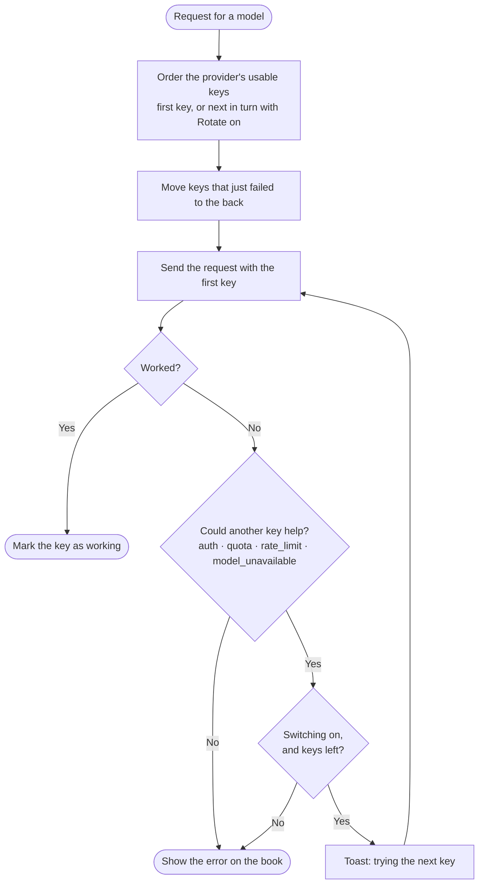
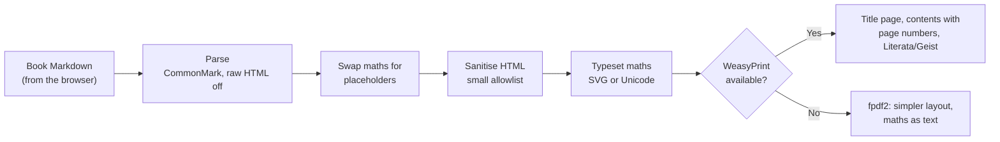

# Architecture

How Infinite Bookshelf is put together: what runs in the browser, what runs on the server, and how
a topic becomes a book.

<details>
<summary><b>Contents</b></summary>

- [The big picture](#-the-big-picture)
- [Design principles](#-design-principles)
- [Writing a book, step by step](#-writing-a-book-step-by-step)
- [API keys: choosing, rotating, switching](#-api-keys-choosing-rotating-switching)
- [The API](#-the-api)
- [The web app](#-the-web-app)
- [Markdown and maths](#-markdown-and-maths)
- [PDF export](#-pdf-export)
- [Security model](#-security-model)

</details>

## 🧩 The big picture

Two parts ship as one Docker image: a **React web app** that owns all the data and drives the
writing, and a **stateless FastAPI server** that turns each request into model calls.



| Endpoint               | Method | What it does                                             | Response           |
| ---------------------- | ------ | -------------------------------------------------------- | ------------------ |
| `/api/config`          | GET    | Built-in providers and what this server allows           | JSON               |
| `/api/models`          | POST   | Lists a provider's models; also how a key is tested      | JSON               |
| `/api/outline`         | POST   | Drafts the outline, then the title                       | Server-Sent Events |
| `/api/sections/stream` | POST   | Writes one section, with the book so far as context      | Server-Sent Events |
| `/api/export/pdf`      | POST   | Typesets a book's Markdown                               | PDF                |
| `/api/health`, `/api`  | GET    | Liveness, and the service's name, version and docs links | JSON               |

The [API reference](../api/README.md) has request bodies, events and error codes.

## 🧭 Design principles

> [!NOTE]
> These shape every other decision in the codebase. A change that breaks one of them needs a very
> good reason.

- **The server is stateless.** No database, no accounts, no sessions. Every request carries what it
  needs, including the user's API key, and nothing is kept afterwards. Any number of users can share
  one server, and restarting it loses nothing.
- **The browser owns the data.** Books live in IndexedDB, settings and keys in localStorage (keys in
  sessionStorage when **Remember my keys** is off). Backups are JSON files the user downloads.
- **The browser drives the writing.** It decides which section comes next and calls the API once per
  section. Pause aborts the current request; Resume starts again at the first unfinished section.
- **Models are chosen per request.** A book stores the model for its outline, title and sections. The
  sections model can change whenever the book is paused, and each saved section records the model
  that wrote it.
- **Nothing is sent that can't work.** Before each request the browser checks that the provider is
  still set up with a usable key. If not, the book shows a setup card instead of a failed request.
- **The engine has no web code.** `api/src/infinite_bookshelf/engine` knows nothing about HTTP;
  `server/` adapts it to the web.

## 📖 Writing a book, step by step

### A book's life

Each book has a status, saved with it in IndexedDB:



| Status     | What the user sees                                                                                      |
| ---------- | ------------------------------------------------------------------------------------------------------- |
| `drafting` | The outline and title arriving live, or a button to draft them                                          |
| `review`   | The outline editor: rename, reorder by drag and drop, change levels                                     |
| `writing`  | The reader, following the section being written                                                         |
| `paused`   | The reader, with **Resume writing** (in chapter-by-chapter mode, a card to read the chapter over first) |
| `complete` | The finished book, with export and rewrite                                                              |

After a page reload nothing is running, so books left in `writing` become `paused`.

### Writing one section



- **Live text** is batched into about 20 screen updates a second, so long sections stay smooth.
- **Saving** happens only after `done`. Pausing, closing the tab or an error loses at most the
  section in progress, which is written again from the start on Resume.
- **A rewrite** sends the current text and the user's note. The original stays saved until the new
  version is complete.
- **Pause** aborts the request. The server notices the disconnect, closes the provider's stream, and
  the model stops writing (and billing).

### Section context

To make chapters build on each other without extra model calls, the API gives the model two things
built from what the browser sends:

1. **The outline** as an indented list, with the current section marked `<-- THIS SECTION`.
2. **A digest of earlier sections:** each one's opening sentence and subheadings, plus the closing
   text of the section just before. The oldest digests are dropped first to keep it within a
   fixed size.

The prompt asks for only the marked section, building on earlier ones instead of repeating them,
and gives a target length: about 500, 1,000 or 2,000 words.

## 🔑 API keys: choosing, rotating, switching

A provider can hold several labelled keys. Books store only provider and model, so the key is
chosen for each request:



A failed key is set aside for a while, so later requests don't start with it: a rate-limited key
for a minute, a rejected key until its secret changes, and a key that can't use a model, for that
model. Key status (working, limited, rejected) is shown as a dot in Settings.

## 🐍 The API

```text
api/src/infinite_bookshelf/
├── engine/                 book-writing logic, no web code
│   ├── agents/
│   │   ├── structure_writer.py   outline: JSON table of contents, repaired and retried
│   │   ├── title_writer.py       title, with a fallback from the topic
│   │   └── section_writer.py     one section, streamed
│   ├── book.py             outline model, outline text, digest of earlier sections
│   ├── generation.py       book options, length presets, inputs for one section
│   ├── client.py           OpenAI-compatible client, provider presets, request adaptation
│   ├── errors.py           error types, classification, key scrubbing, JSON error payloads
│   ├── stats.py            token counts and timings
│   └── pdf.py              Markdown → sanitised HTML → PDF
└── server/                 HTTP layer
    ├── __main__.py         the infinite-bookshelf-api command (uvicorn)
    ├── app.py              routes and middleware
    ├── streaming.py        runs the engine's generators in threads as Server-Sent Events
    ├── security.py         which addresses may be called, the rate limiter
    ├── schemas.py          request and response models
    ├── config.py           IB_* settings and .env files
    ├── docs.py, openapi.py the API docs page and its examples
    └── static/             docs styling and fonts (Geist, and Literata for PDFs)
```

### Middleware

Every request passes through these layers, outermost first:

| Layer            | What it does                                                                  |
| ---------------- | ----------------------------------------------------------------------------- |
| Proxy headers    | Takes the visitor's IP from `X-Forwarded-For`, only from `IB_TRUSTED_PROXIES` |
| Security headers | Content Security Policy, `nosniff`, `no-referrer`, no framing                 |
| Request guard    | Rate limit per IP on writing endpoints, then the request size limit           |
| CORS             | Only when `IB_CORS_ORIGINS` is set                                            |

### Streaming

Long operations answer a POST with Server-Sent Events:

| Endpoint               | Events, in order                                           |
| ---------------------- | ---------------------------------------------------------- |
| `/api/outline`         | `stage` → `outline` → `stage` → `title` → `stats` → `done` |
| `/api/sections/stream` | `start` → `delta` (many) → `stats` → `done`                |

Either may end with an `error` event instead. The engine's generators are ordinary synchronous
Python; `streaming.py` runs each step in a worker thread and, when the browser disconnects, closes
the generator, which closes the provider's stream. A ping every 15 seconds keeps proxies from
closing the connection while a model thinks.

### Working with many providers

Every provider is called through the OpenAI Python SDK, so anything that speaks the Chat Completions
API works. `client.chat_completion` smooths over the differences:

- **Reasoning models** (`o1`-style, `gpt-5`, `gpt-6`) get `max_completion_tokens` and no
  `temperature` up front.
- **Rejected parameters:** if a provider refuses an optional one (`stream_options`,
  `response_format`, `temperature`, `max_tokens`), it is dropped or renamed and the request retried.
- **Errors** become a small set of codes the web app understands. Outlines that come back as broken
  JSON are repaired, or retried.

### Errors

Every error has the same shape: `{code, title, message, hint, detail}`, with API keys removed.
`message` is the provider's own explanation when its error contains one (read from OpenAI-style,
Gemini and OpenRouter error bodies); `detail` keeps the full error, which the web app shows under
"Show full error".

| Code                   | Meaning                                     | Another key may help |
| ---------------------- | ------------------------------------------- | :------------------: |
| `auth`                 | Key missing, invalid or not allowed         |          ✅          |
| `quota`                | The key's account is out of credits         |          ✅          |
| `rate_limit`           | Provider's rate limit reached               |          ✅          |
| `model_unavailable`    | Model not found, or this key can't use it   |          ✅          |
| `model_busy`           | Model overloaded (HTTP 502–504, 529)        |                      |
| `bad_request`          | Provider rejected the request               |                      |
| `connection`           | Provider couldn't be reached, or redirected |                      |
| `timeout`              | Provider stopped answering (after 3 min)    |                      |
| `empty_response`       | Model finished without writing any text     |                      |
| `outline`              | The outline couldn't be parsed              |                      |
| `generation_error`     | Anything else from the provider             |                      |
| `invalid_input`        | The request itself is wrong                 |                      |
| `endpoint_not_allowed` | This server may not call that address       |                      |
| `rate_limited`         | This server's own rate limit                |                      |
| `too_large`            | Request bigger than `IB_MAX_REQUEST_BYTES`  |                      |

## 🌐 The web app

```text
web/src/
├── pages/            Home (/), Write (/new), My books, Book, Settings, 404
├── components/
│   ├── book/         Reader (live view, contents, rewrite), OutlineEditor (drag and drop)
│   ├── settings/     providers, their keys and models, the Add provider dialog
│   ├── home/         the home page's illustrations
│   ├── layout/       AppShell: header, navigation, footer
│   ├── ui/           buttons, fields, dialogs, menus (Radix + Tailwind)
│   └── Markdown, ModelSelect, BookCover, Logo, ProviderIcon
└── lib/
    ├── runner.ts     the writing loop: outline, sections, pause, rewrite, key switching
    ├── api.ts        requests and Server-Sent Events parsing
    ├── api-url.ts    where the API is: config.js, then VITE_API_URL, then /api
    ├── site-links.ts absolute link-preview URLs from VITE_SITE_URL at build time
    ├── db.ts         IndexedDB (Dexie)
    ├── settings.ts   preferences, providers, keys, key order, setup checks (zustand)
    ├── key-*.ts      tidying pasted keys, key status, testing keys
    ├── model-picks.ts  suggested models per step
    ├── markdown.ts   tidying model Markdown
    ├── outline.ts    outline helpers, editable rows, Markdown export
    └── export.ts     Markdown, PDF, and JSON backup and import
```

Pages other than the home page load on first visit. Writing runs outside React, so moving between
pages never stops it.

### What's stored where

| Storage                        | Key                  | Contents                                                     |
| ------------------------------ | -------------------- | ------------------------------------------------------------ |
| IndexedDB                      | `infinite-bookshelf` | Books: options, outline, sections, models, stats, status     |
| localStorage                   | `ib-preferences`     | Theme, reading size, writing defaults, recent models         |
| localStorage                   | `ib-services`        | Providers, their models, custom endpoints, key labels        |
| localStorage or sessionStorage | `ib-api-keys`        | Key secrets, by key id (sessionStorage when Remember is off) |
| localStorage                   | `ib-key-health`      | Last known status of each key; no secrets                    |

## 🧮 Markdown and maths

Models write Markdown, often with LaTeX maths as `$…$`, `\(…\)` or `\[…\]`, and sometimes prices
like "$5 and $10". Before anything is shown or exported, `lib/markdown.ts`:

- turns `\( \)` and `\[ \]` into dollars;
- escapes a `$` that can't open or close maths, by Pandoc's rules (no space just inside, no digit
  after the closing one), so prices stay prices;
- never touches code.

The reader renders the result with remark-gfm, remark-math, KaTeX and highlight.js. The PDF export
receives the same tidied text, so the reader and the PDF agree.

## 📄 PDF export



1. **Parse** as CommonMark with tables and strikethrough, raw HTML off. A list straight after a line
   of text is still a list, which is how models usually write them.
2. **Maths** (`$…$`, `$$…$$`) is swapped for placeholders, so it never passes through the sanitiser
   as markup.
3. **Sanitise** with nh3 to a small allowlist of text formatting: no images, styles or embeds.
4. **Typeset maths** into the placeholders: SVG from ziamath, or Unicode text (a² + b² = c²) for the
   fallback.
5. **Render.** WeasyPrint lays out a title page, contents with page numbers, a new page per chapter
   with its name in the running header. It may load only the bundled fonts and the maths images
   from step 4: no other files and no network addresses.

## 🔒 Security model

| Concern                              | Protection                                                                                                                                                                     |
| ------------------------------------ | ------------------------------------------------------------------------------------------------------------------------------------------------------------------------------ |
| **API keys on the server**           | `SecretStr` in request models; never logged; removed from error messages; validation errors never echo the request                                                             |
| **API keys in the browser**          | The page loads no third-party scripts, under a strict CSP (`script-src 'self'`); fonts and icons are self-hosted                                                               |
| **Calling private addresses (SSRF)** | Unless `IB_ALLOW_PRIVATE_ENDPOINTS` is on: custom base URLs must be `https://` and resolve to public addresses, their redirects aren't followed, and local presets are refused |
| **Script injection**                 | Model output is rendered without raw HTML; KaTeX runs with `trust` off; links are sanitised                                                                                    |
| **PDF export**                       | Raw HTML off, sanitised output, placeholders that text can't forge, a renderer that can't read files or reach addresses, and caps on maths                                     |
| **Faked visitor IPs**                | `X-Forwarded-For` is believed only from `IB_TRUSTED_PROXIES`                                                                                                                   |
| **Abuse of a shared server**         | Per-IP rate limit and a request size limit                                                                                                                                     |
| **Removing a provider**              | Deletes its keys and their secrets from the browser                                                                                                                            |

> [!WARNING]
> The address check resolves a hostname before the request is made, so a hostile DNS server could
> answer differently a moment later (DNS rebinding). Public instances should also block private IP
> ranges at the network level.

To report a vulnerability, see the [security policy](../SECURITY.md).
